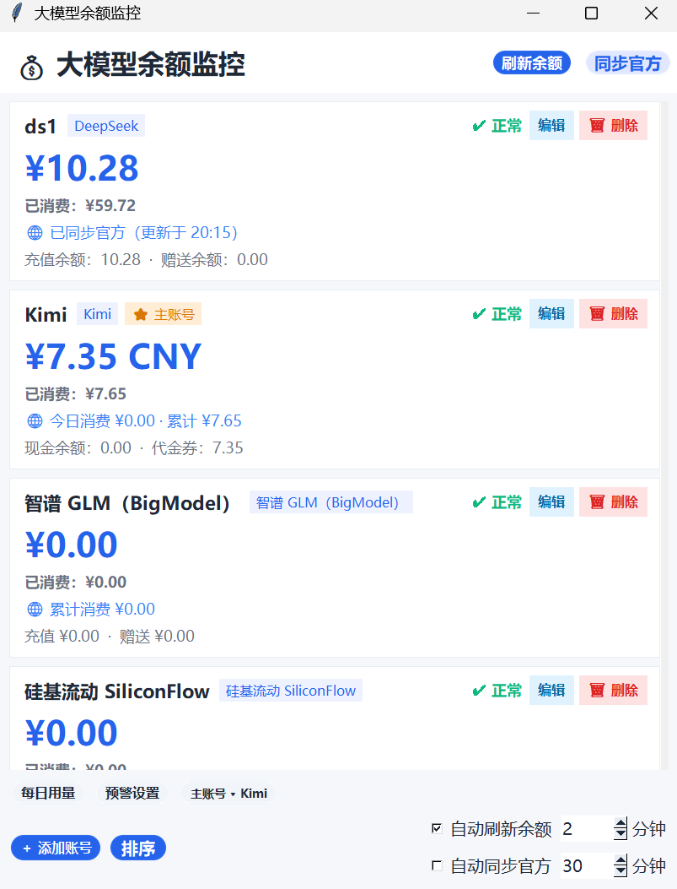
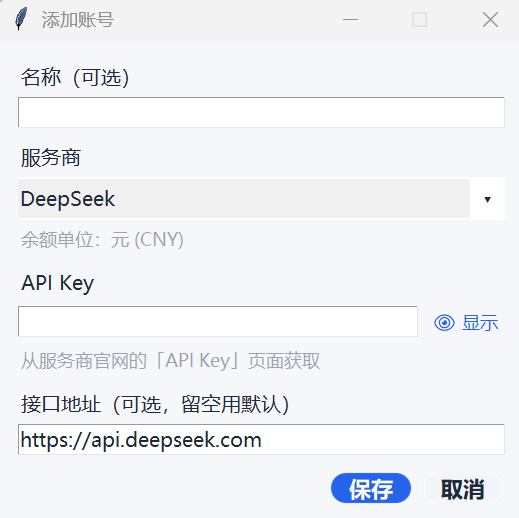

# 大模型余额监控（API Balance Monitor）


> 本项目使用 **MIT License** 开源，详见 [LICENSE](LICENSE)。

一个 Windows / macOS / Linux 桌面应用，把多家大模型 API 的**账户余额**和**累计已消费金额**集中到一个界面统一查看，并提供每日用量日历、每小时 Token 分布、余额预警等能力。





---

## 项目解决的问题

同时使用多个大模型 API（DeepSeek、Kimi、智谱、硅基流动、OpenRouter 等）时，余额和消费分散在各自平台的后台，需要频繁登录查看。本工具把这些平台的余额与累计消费集中到一个桌面界面，避免反复登录，并额外提供每日用量、Token 分布、余额预警等辅助能力。

## 功能概览

- **支持接入以下大模型服务商**，统一监控账户余额与累计消费：
  - DeepSeek
  - Kimi
  - 智谱 GLM（BigModel）
  - 硅基流动（SiliconFlow）
  - OpenRouter
  - 通用中转站（兼容 OpenAI 计费 / new-api / one-api 等主流中转）
- **可读取的数据**：账户余额、累计已消费总金额（部分平台含充值 / 赠送明细）
- **每日用量日历**：按日展示消费金额（DeepSeek / OpenRouter 含 Token 用量）
- **每小时 Token 分布图**（DeepSeek / OpenRouter 官方接口提供）
- **金额显示自动适配服务商币种单位**（人民币 ¥ / 美元 $）
- **本地离线图标资源**：图标以内嵌 base64 保存，不依赖外部文件、可离线运行
- **多账号管理**：添加 / 编辑 / 删除 / 排序 / 设置主账号
- **余额预警**：主账号余额低于阈值时提醒
- **自动刷新余额、自动同步官方**（浏览器抓取官方数据）
- **开机自动同步官方数据**

## 技术栈

- **语言**：Python 3.8+
- **桌面 GUI**：tkinter（Python 标准库）
- **UI 组件**：自绘 iOS 风格圆角按钮 / 卡片（基于 Pillow 抗锯齿渲染）
- **HTTP 请求**：requests
- **浏览器自动化**：Playwright（驱动系统 Edge / Chromium，用于官方数据同步）
- **数据存储**：本地 JSON（`~/.model_balance/`），API Key 使用 Windows DPAPI 加密
- **打包**：PyInstaller
- **持续集成**：GitHub Actions（Windows / macOS / Linux 三平台自动构建）

## 系统要求

- **Windows**：Windows 10 / 11（自带 Edge，无需额外安装浏览器）
- **macOS**：macOS 10.15 及以上
- **Linux**：主流发行版（需安装 `python3-tk`，见下文「从源码运行」）
- **需要联网**：查询余额、同步官方数据均需访问服务商官网 / 接口

## 快速开始

### 下载安装包（推荐给普通使用者）

安装包发布在 **GitHub Releases 页面**，无需安装 Python：

1. 打开 [Releases 页面](https://github.com/zyy20080117/API-balance-monitor/releases)
2. 下载对应平台的安装包：
   - **Windows**：`API-Balance-Monitor-windows-amd64.exe`
   - **macOS**：`API-Balance-Monitor-macos`
   - **Linux**：`API-Balance-Monitor-linux-amd64`
3. 双击运行（macOS 首次打开需在「系统设置 → 隐私与安全性」允许来自未识别开发者；Windows 若被 SmartScreen 拦截，点「仍要运行」）

> 安装包不包含在源码仓库中，仅发布在 GitHub Releases。

### 添加你的第一个 API 账号

1. 打开软件，点击「＋ 添加账号」
2. 选择**服务商**（如 DeepSeek、Kimi、智谱、硅基流动、OpenRouter 等）
3. 到该服务商官网的「API Key」页面复制 Key，粘贴到输入框
4. 点击**保存**，余额会自动查询并显示

> 智谱没有公开余额接口，还需在软件弹出的浏览器窗口里登录一次（点击「同步官方」时触发）。
> 详细配置教程见 [DOCS.md](DOCS.md)。

### 各平台运行注意事项

- **Windows**：自带 Edge，开箱即用；若杀毒软件误报请参考 [docs/FAQ.md](docs/FAQ.md)
- **macOS**：首次打开安装包需在系统设置允许运行
- **Linux**：见下方「从源码运行」的 tkinter 说明

### 从源码运行（开发者）

需要 Python 3.8+：

```bash
pip install -r requirements.txt
python main.py
```

> 依赖：`tkinter`、`PIL(Pillow)`、`requests`、`playwright`
>
> **Linux 用户**：运行前需先安装 tkinter——
> ```bash
> sudo apt install python3-tk
> ```

运行全部测试：

```bash
python run_tests.py
```

打包安装包（多平台自动构建见 [.github/workflows/build.yml](.github/workflows/build.yml)）：

```bash
pyinstaller ModelBalance.spec --noconfirm
```

详细配置教程、参数说明与故障排错见 [DOCS.md](DOCS.md)。

## 数据安全

- **API Key 只保存在本地**：存储在 `~/.model_balance/accounts.json`，**Windows 下使用 DPAPI（当前系统用户绑定）加密**
- **不会上传到任何第三方服务器**：所有请求仅发往各服务商官方接口
- **浏览器登录态也只保存在本地**：`~/.model_balance/browser_profile`，用于同步官方数据
- **开源可自行审计**：全部源码公开，可核对数据存储与网络行为

## 已知限制

1. 当前所有接入模型，仅能够获取账户余额、累计已消费总金额；本工具**不支持查询单条 Token 消耗明细**。
2. 绝大多数服务商官方 API 不提供账单明细接口：**无法获取单次请求消耗、无法按日期查看历史消费、无法区分不同 API‑Key 各自消耗**。
3. 软件内部本地统计仅供参考，统计数值会和官方网页后台存在偏差，**一切以服务商网页账单为准**。
4. 部分平台没有官方余额查询 API，暂时无法接入，列入待开发。
5. 待开发功能：**GPT、Gemini、Claude 三家模型余额查看功能，尚未实现**。

## 开发计划

当前正在开发功能：GPT、Gemini、Claude 三家模型的余额查看功能。

## 贡献指引

欢迎任何形式的贡献：提交 Issue、完善文档、修复 Bug、新增服务商支持。

1. **Fork** 本仓库，并新建分支（`feature/xxx` 或 `fix/xxx`）
2. 修改代码，补充/更新测试（`tests/test_*.py`）
3. 提交并推送分支，然后创建 **Pull Request**
4. 说明改动内容与测试结果

编码规范：
- 遵循现有代码风格（Python 3，中文注释）
- 每个新增服务商同步模块放在独立文件（如 `xxx_sync.py`），并在 `providers.py` 注册
- 合并前需通过全部测试：`python run_tests.py`

完整的开发环境搭建、服务商接入流程见 [CONTRIBUTING.md](CONTRIBUTING.md)，架构说明见 [docs/ARCHITECTURE.md](docs/ARCHITECTURE.md)。

## 开源协议

本项目使用 [MIT License](LICENSE)。
